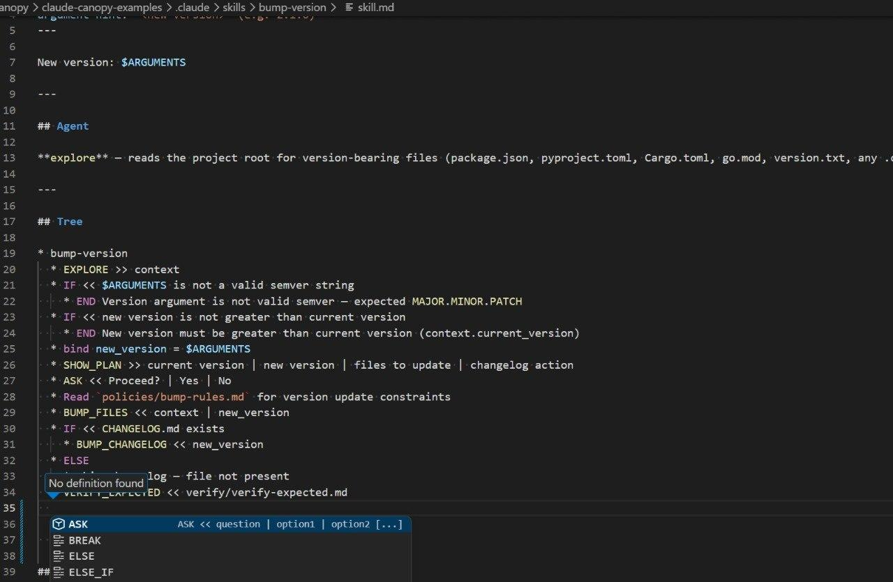
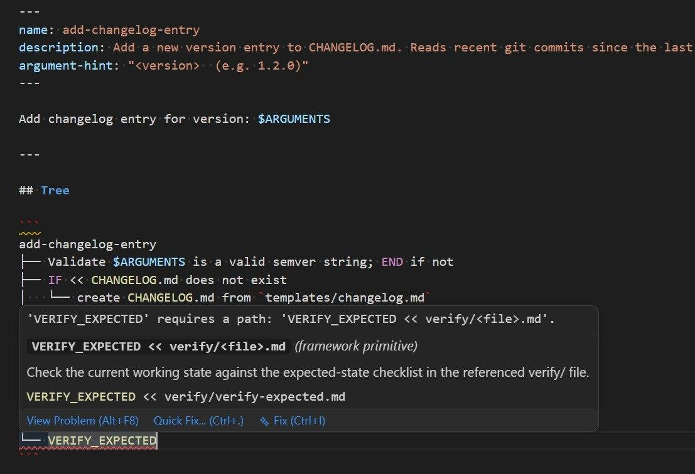
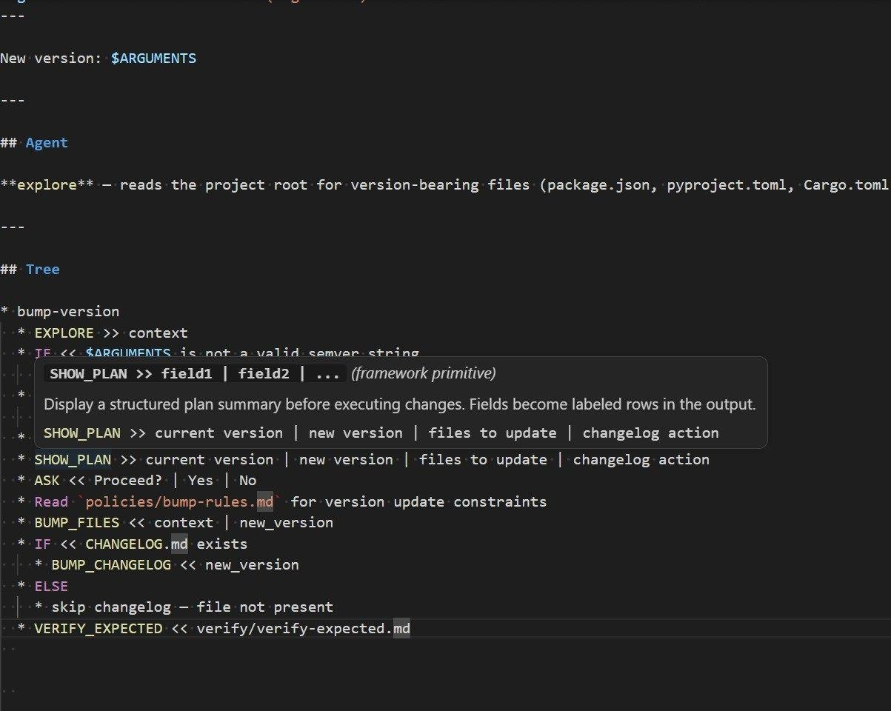

# Canopy Skills for VS Code

> Write Claude Code / GitHub Copilot skills as executable code, not prose.

[](https://github.com/kostiantyn-matsebora/claude-canopy-vscode/releases/latest)
[](LICENSE)

IntelliSense, semantic diagnostics, and go-to-definition for [Canopy](https://github.com/kostiantyn-matsebora/claude-canopy) skills — the declarative, tree-structured execution framework for AI agents. Tracks framework **v0.15.0**.

> **Not on the VS Code Marketplace yet.** Install the `.vsix` from the latest [GitHub Release](https://github.com/kostiantyn-matsebora/claude-canopy-vscode/releases/latest). Marketplace listing is planned for a future release.

## What is Canopy?

**Canopy** is a framework for writing AI skills as structured, executable code rather than freeform prose. Instead of describing what an AI agent should do in plain text, you define skills as a tree of named operations with explicit control flow, inputs, and outputs — then run them through Claude Code or GitHub Copilot.

A Canopy skill looks like this:

```markdown
---
name: review-pr
description: Review a pull request for correctness and style
---

## Tree

* FETCH_PR << PR_URL
* IF << changes_are_large >>
  * SPLIT_INTO_SECTIONS
* ELSE
  * REVIEW_IN_ONE_PASS
* SHOW_PLAN >> review_summary
```

Key ideas:

- **Skills** (`skill.md`) define behavior as a tree of operation calls.
- **Ops** (`ops.md`) define reusable named operations local to a skill or shared across skills.
- **Framework primitives** (`IF`, `ELSE_IF`, `ELSE`, `BREAK`, `ASK`, `VERIFY_EXPECTED`, `EXPLORE`, `SHOW_PLAN`, …) are built-in control-flow ops provided by the framework.
- **Resources** (constants, policies, templates, schemas, verify checklists, command scripts) are supporting files co-located with each skill.
- Skills can target **Claude Code** (`.claude/skills/`) or **GitHub Copilot** (`.github/skills/`).

Canopy turns AI instructions into something you can read, review, version-control, lint, and refactor — like real code.

## Installation

The extension is distributed as a `.vsix` on GitHub Releases until the Marketplace listing is live.

1. Download the latest `canopy-skills-<version>.vsix` from the [Releases page](https://github.com/kostiantyn-matsebora/claude-canopy-vscode/releases/latest).
2. Install from the command line:
   ```bash
   code --install-extension canopy-skills-<version>.vsix
   ```
   Or in VS Code: **Extensions** panel → **…** menu → **Install from VSIX…** → pick the file.

## What this extension does

Turns Canopy skill files into a first-class editor experience: live semantic validation with Quick Fixes, autocomplete for every primitive and custom op, inline hover docs, and go-to-definition across the skill → project → framework op lookup chain. Ships scaffolding commands for every resource type plus direct integration with the Canopy AI agent via `claude` or `gh copilot suggest`.

## In action

### Autocomplete for primitives and custom ops

Type a tree-node prefix and get completions for every `IF`, `ELSE`, `ASK`, `SHOW_PLAN`, `VERIFY_EXPECTED`, and any custom op defined in the current skill, the project, or the framework.



### Semantic diagnostics with Quick Fixes

Real-time validation catches primitive signature violations, missing frontmatter, wrong `<<`/`>>` usage, and broken resource references — before you run the skill.



### Inline documentation for every primitive

Hover any `ALL_CAPS` identifier to see its signature, description, and how it flows with `<<` / `>>` — no context switching to the framework docs.



## Commands

All commands are accessible via the Command Palette (`Ctrl+Shift+P` / `Cmd+Shift+P`).

### ✨ Agent — describe it, let AI write it (`Canopy Agent` category)

**Start here.** No deep framework knowledge required — describe what you want in plain English and the Canopy AI agent writes, validates, and refines the skill for you. Auto-detects the installed AI target (Claude Code under `.claude/` or GitHub Copilot under `.github/`) and invokes `claude "<prompt>"` or `gh copilot suggest "<prompt>"`.

| Command | What it does |
|---|---|
| **Create Skill** | Describe a skill; the agent writes it end-to-end |
| **Modify Skill** | Pick a skill and describe the change |
| **Scaffold Skill** | Provide a name; the agent creates the blank structure |
| **Convert to Canopy** | Converts a plain-markdown skill to Canopy tree format |
| **Validate Skill** | Checks a skill against all framework rules |
| **Improve Skill** | Aligns a skill with the latest framework conventions |
| **Advise** | Ask the agent a design question about Canopy |
| **Refactor Skills** | Extracts shared ops and resources across multiple skills |
| **Convert to Regular Skill** | Converts a Canopy skill back to plain markdown |
| **Help** | Lists all available agent operations |

### Setup (`Canopy` category)

Add the Canopy framework to your project.

| Command | Description |
|---|---|
| **Add as submodule** | Adds Canopy as a git submodule; prompts for Claude (`.claude/`) or Copilot (`.github/`) target |
| **Add as copy (minimal files)** | Shallow-clones Canopy and copies the minimum required files; same target prompt |

### Scaffold — manual authoring (`Canopy` category)

For authors who know the framework and prefer to hand-write skills and resources. Each command drops a correctly-structured blank file at the right path — you fill in the content.

| Command | Description |
|---|---|
| **New Skill** | Creates `skill.md` + `ops.md` for a new skill |
| **New Verify File** | Scaffolds a `verify/` checklist |
| **New Template** | Scaffolds a `templates/` file (`.md`, `.yaml`, or `.yaml.gotmpl`) |
| **New Constants File** | Scaffolds a `constants/` lookup file |
| **New Policy File** | Scaffolds a `policies/` rule file |
| **New Commands File** | Scaffolds a `commands/` script (`.ps1` or `.sh`) |
| **New Schema** | Scaffolds a `schemas/` file |

## Features

### Syntax highlighting

Five language IDs cover all Canopy file types:

| Language | Files | Highlights |
|---|---|---|
| `canopy` | `skill.md`, `ops.md` | Tree notation, `IF`/`ELSE`, `<<`/`>>`, op names, binding expressions |
| `canopy-verify` | `verify/*.md`, `checklists/*.md` | Checkbox items |
| `canopy-template` | `templates/*.md`, `templates/*.yaml` | `<token>` placeholders |
| `canopy-resource` | `constants/*.md`, `policies/*.md`, `schemas/*.md` | Tables, numbered rules |
| `canopy-commands` | `commands/*.ps1`, `commands/*.sh` | `# === Section Name ===` headers |

All patterns cover both `.claude/` (Claude Code) and `.github/` (GitHub Copilot) targets.

### IntelliSense

Completions in `skill.md` and `ops.md`:

| Completion | What it suggests |
|---|---|
| Op names | Ops from the current skill, project-level ops, and framework primitives; inserts the correct tree-node prefix (`* ` / `├── `) automatically |
| Primitives | All framework built-ins with descriptions |
| Frontmatter | `name`, `description`, and other known keys |
| Category resources | ``Read `category/path` `` directives for `constants/`, `policies/`, `templates/`, `schemas/`, `verify/` |

### Hover documentation

Hovering over a framework primitive or a custom op shows its description, expected `<<` input and `>>` output, and a usage example.

### Go-to-definition

Press `F12` (or right-click → Go to Definition) on any `ALL_CAPS` identifier. The extension resolves through:

1. Current skill's `ops.md`
2. Project-level `ops.md` files
3. Framework `skills/shared/framework/ops.md`

### Semantic diagnostics

Real-time squiggles for:

| Check | Catches |
|---|---|
| Frontmatter | Missing `name` or `description`, empty values, unknown keys |
| Tree syntax | `>>` before `<<`, empty operator slots |
| Primitive signatures | `IF`/`ELSE_IF` without `<<`; `ASK` without `\|` options; `SHOW_PLAN` without `>>`; `VERIFY_EXPECTED` wrong path prefix; `ELSE`/`BREAK` with spurious operators; `EXPLORE` without `>>` |
| Resource references | ``Read `category/path` `` uses a recognised category and the file exists on disk; `VERIFY_EXPECTED` target file existence |
| Unknown ops | Configurable severity for `ALL_CAPS` names not found in any registry |
| Op conformance hints | Tree node's `<<`/`>>` usage doesn't match the op's declared signature |

## Requirements

- VS Code 1.85 or later
- For **Add as submodule** / **Add as copy**: `git` in PATH
- For **Canopy Agent** commands: `claude` CLI (Claude Code) **or** `gh` CLI with the Copilot extension

## Settings

| Setting | Default | Description |
|---|---|---|
| `canopy.frameworkUrl` | `https://github.com/kostiantyn-matsebora/claude-canopy` | Framework repo URL used by setup commands |
| `canopy.validate.enabled` | `true` | Enable/disable all real-time validation |
| `canopy.validate.unknownOps` | `"warning"` | Severity for unresolved op names: `error`, `warning`, `hint`, `none` |
| `canopy.validate.opConformance` | `true` | Show hints when `<<`/`>>` usage doesn't match the op's declared signature |

## Building from source

```bash
npm install
npm run compile      # one-shot TypeScript compile
npm run watch        # watch mode
npm run package      # produces canopy-skills-<version>.vsix
```

Press `F5` in VS Code to open an Extension Development Host with the extension loaded.

## Links

- [Canopy framework](https://github.com/kostiantyn-matsebora/claude-canopy)
- [Extension source](https://github.com/kostiantyn-matsebora/claude-canopy-vscode)
- [Changelog](CHANGELOG.md)
